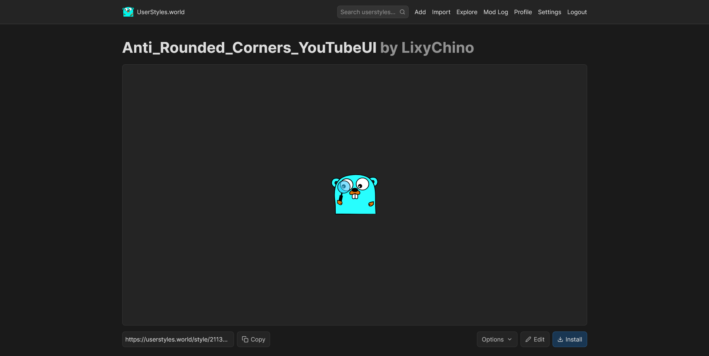

<h1>Anti_Rounded_Corners_YouTubeUI</h1>

このCSSファイルは、2022年10月ごろから導入されてしまったYouTubeの角丸UIを以前のカクカクUIに戻すCSSファイルです。

このCSSファイルは、<a href=https://m.youtube.com>モバイルブラウザ版YouTube(m.youtube.com)</a>を対象に作成されています。<a href=https://www.youtube.com>PCブラウザ版YouTube(www.youtube.com)</a>では使えないのでご注意ください。

開発/動作検証環境(故に動作確認済み環境)は以下の通りです。

<ul>
  <li>ブラウザ:Firefox Beta 133.0b9(バージョン1.28以前はFirefox Beta 124.0b5)</li>
  <li>拡張機能(カスタムCSSを読みこむのに必要)：Stylus</li>
  <li>スマホ：Galaxy S22</li>
</ul>

その他使用している(というか必要な)拡張機能

<ul>
  <li>Tampermonkey(低評価数を表示するために使用。)</li>
</ul>

以前使用していた拡張機能

<ul>
  <li>Stylebot(バージョン1.4まで使用されていました。カスタムCSSを動かす為の拡張機能です。現在はStylusに置き換えられています。)</li>
  <li>uBlock Origin(バージョン1.19まで使用していました。要素のブロック用です。現在は要素ブロックをカスタムCSSに混ぜ混んだ(display:none;を使用)為廃止されました。)</li>
</ul>
<h2>機能紹介</h2>
  <h3>YouTubeの角丸UIを抹消！！</h3>
    
このCSSを適用すると、モダンな角丸UIを以前のカクカクしたUIに戻すことが出来ます！！

    <small><small>
※バージョン16.10のYouTubeアプリ辺りをイメージして作成しています。
</small></small>
    
  <h3>高評価ボタンや低評価ボタンを以前のスタイルに近い状態に！！</h3>
    
高評価ボタンや低評価ボタンが以前の大きくて押しやすいボタンになります！！

    <small><small>
※v1.5から実装しています。
</small></small>
    
  <h3>チャンネル登録者数の表記が現行の簡略化されすぎた表記から以前のある程度の簡略化まで変更</h3>
    
現行の表記は数字(チャンネルによっては万などの表記もある)のみですが、このCSSを適用すると以前の「チャンネル登録者数○○人」という表記が復活します！！

    
    <small><small>
※登録者数が1万人以上のチャンネルにおいて、登録者数自体が1人単位で見えるようになるものではありません。
</small></small>
    <small><small>
※v1.3から実装しています。
</small></small>
  <h3>概要欄に素早くアクセス！！</h3>
    
タイトルをタップした後さらにもう1回タップしなきゃいけないのは意味不明！！ということでタイトルをタップしたらその時点で概要欄がすべて見えるように改良しました！！

    
    <small><small>
※v1.5から実装しています。
</small></small>
<h2>導入方法</h2>
  
0.あらかじめFirefox BetaにStylusとTampermonkeyをインストールします。 また、YouTubeアプリの「対応するリンクを開く」設定を無効化してください。

  <ol>
    <li>「Releases」から最新のファイルをダウンロードする。</li>
    <li>ファイルエディターからでもなんでもいいのでダウンロードしたzipファイルを解凍する。</li>
    <li>解凍したら「anti_rounded_corners_YouTubeUI_v1.x」というtxtファイルができます。</li>
    <li>「anti_rounded_corners_YouTubeUI_v1.x」というtxtファイルの中にcssが入っているので、内容をすべて選択し、クリップボードにコピーする。</li>
    <li>Firefox Betaを開いて、右上の点３つ→「アドオン」→「Stylus」→「管理」→「スタイルを新規作成」の順にタップする。(この段階でデスクトップサイトを有効化しておいてください。そうしないと「スタイルに追加」が上手く押せないんですよね)</li>
    <li>「インポート」をタップして、「Mozilla形式のコードを貼り付ける」というものが出たら、そこに先ほどコピーしたcssをペーストする。</li>
    <li>「スタイルに追加」をタップして、左上の「保存」をタップする。</li>
    <li><a href=https://greasyfork.org/en/scripts/436115-return-youtube-dislike/code>こちらのリンク</a>からReturn YouTube Dislike(Tampermonkey版)のインストール画面へ行く。</li>
    <li>「Install this sctipt」をタップする。</li>
    <li>「インストール」をタップする。</li>
  </ol>
    
以上で導入は終了です。お疲れさまでした。

<h2>Anti_Rounded_Corners_YouTubeUIの更新について</h2>
		
<s>現時点ではAnti_Rounded_Corners_YouTubeUIに自動アップデート機能はありません。</s> 
		<s>恐れ入りますが、最新バージョンへの更新は以下の手順に沿ってご利用者様が手動で行ってください。</s>

  		
バージョン1.32から試験的にUserStyles.worldを用いた自動アップデートを導入しました。

    		
<a href="https://userstyles.world/style/21139/anti-rounded-corners-youtubeui">こちら</a>からAnti_Rounded_Corners_YouTubeUIをインストールすると、自動アップデート機能が利用できます。

      		
  <h2>更新方法</h2>
      <ol>
        <li>「Releases」から最新のファイルをダウンロードする。</li>
        <li>ファイルエディターからでもなんでもいいのでダウンロードしたzipファイルを解凍する。</li>
        <li>解凍したら「uBlock」フォルダと「anti_rounded_corners_YouTubeUI_v1.x」というtxtファイルができます。</li>
        <li>「anti_rounded_corners_YouTubeUI_v1.x」というtxtファイルの中にcssが入っているので、内容をすべて選択し、クリップボードにコピーする。</li>
        <li>Firefox Betaを開いて、「Stylus」→ 右上の点３つ→「アドオン」→「Stylus」→「管理」→Anti_Rounded_Corners_YouTubeUIを記載したスタイルの名前をタップします(この段階でデスクトップサイトを有効化しておいてください。)。</li>
          
        <li>「インポート」をタップします。</li>
          
        <li>するとこのような入力画面が表示されます。ここに先ほどコピーしたCSSファイルの内容を貼り付けてください。</li>
          
        <li>完了したら「スタイルを上書き」をタップしてください。</li>
          
        <li>最後に「保存」をタップして完了です！！</li>
      </ol>
  <h2>注意点</h2>
  <ul>
    <li>通知バーはモバイルブラウザ版YouTubeの仕様上見ることが出来ません。</li>
    <li>全画面表示にするとブラウザを再起動するまでホームの下のタブが消えます。</li>
    <li>事前にアンビエントモード(シネマティックライティング)をオフにしておく必要があります。(遅くてもカスタムCSSを適用する前までには)</li>
   <li>素人が自分用に作ったものなのでバグ多めです。たまに修正しますが、完全に直せるわけではないのでご了承ください。</li>
    <li>まともな仕上がりになっているのはv1.5以降です。それ以前は実質ベータ版だとお考え下さい(v0.xとかじゃないけど)。</li>
    <li>現時点ではダークモード以外には対応していません。ライトモードを使用している方ごめんなさい。</li>
    <li>仕様上、2本以上の広告が流れる際の「1/2」などの表示には対応していません。ご了承ください。</li>
    <li>このカスタムCSSは日本語版向けに制作されています。他の言語には対応していません。ごめんなさい。This CSS file is only available in Japanese.</li>
    <li>低評価の表示にはAnarios & JRWR様が制作した「Return YouTube Dislike」を使用しています。</li>
    <li>もしかしたら環境によっては動かないかもしれません。ゆるして</li>
  </ul> 
	<h2>クレジット表記</h2>
    
このCSSの一部にはクリエイティブコモンズやその他クレジット表記が必要なコンテンツが含まれています。 それらの表記を追加しています。

	  <a href="https://iconscout.com/icons/history" class="text-underline font-size-sm" target="_blank">History</a> by <a href="https://iconscout.com/contributors/icon-stockes" class="text-underline font-size-sm" target="_blank">Stockes Design</a>
	  
履歴アイコン

	  <a href="https://iconscout.com/icons/library-add" class="text-underline font-size-sm" target="_blank">library add</a> by <a href="https://iconscout.com/contributors/graphic-room" class="text-underline font-size-sm" target="_blank">Venus</a>
	  
ライブラリのアイコン

	  <svg xmlns="http://www.w3.org/2000/svg" width="128" height="128" fill="none" viewBox="0 0 128 128" id="library-add"><path stroke="#000" stroke-width="8" d="M72 79L72 35M50 57L94 57"></path><rect width="79" height="79" x="32" y="17" stroke="#000" stroke-width="8"></rect><path stroke="#000" stroke-width="8" d="M17 32V111H96"></path></svg>
	  <a href="https://iconscout.com/icons/add-playlist" class="text-underline font-size-sm" target="_blank">add playlist</a> by <a href="https://iconscout.com/contributors/google-inc" class="text-underline font-size-sm">Google Inc.</a> on <a href="https://iconscout.com" class="text-underline font-size-sm">IconScout</a>
	  
再生リストのアイコン

	  <svg xmlns="http://www.w3.org/2000/svg" width="24" height="24" viewBox="0 0 24 24" id="add-playlist"><path d="M13 10H3c-.55 0-1 .45-1 1s.45 1 1 1h10c.55 0 1-.45 1-1s-.45-1-1-1zm0-4H3c-.55 0-1 .45-1 1s.45 1 1 1h10c.55 0 1-.45 1-1s-.45-1-1-1zm5 8v-3c0-.55-.45-1-1-1s-1 .45-1 1v3h-3c-.55 0-1 .45-1 1s.45 1 1 1h3v3c0 .55.45 1 1 1s1-.45 1-1v-3h3c.55 0 1-.45 1-1s-.45-1-1-1h-3zM3 16h6c.55 0 1-.45 1-1s-.45-1-1-1H3c-.55 0-1 .45-1 1s.45 1 1 1z"></path></svg>
	   
	  <a href="https://iconscout.com/icons/check" class="text-underline font-size-sm" target="_blank">check</a> by <a href="https://iconscout.com/contributors/google-inc" class="text-underline font-size-sm">Google Inc.</a> on <a href="https://iconscout.com" class="text-underline font-size-sm">IconScout</a>
	  
チェックマーク

	   
以下は過去に使用していたアイコン(バージョンアップに伴い使用しなくなったアイコン)

		  <a href="https://commons.wikimedia.org/wiki/File:Ic_library_add_48px.svg">Google Inc.</a>, <a href="http://www.apache.org/licenses/LICENSE-2.0">Apache License 2.0, via Wikimedia Commons</a>
		  
再生リストのアイコン

		  <a href="https://commons.wikimedia.org/wiki/File:History_(CoreUI_Icons_v1.0.0).svg">CoreUI</a>, <a href="https://creativecommons.org/licenses/by/4.0">CC BY 4.0, via Wikimedia Commons</a>
		  
履歴アイコン
 
    		<a href="https://iconscout.com/icons/user" class="text-underline font-size-sm" target="_blank">User</a> by <a href="https://iconscout.com/jp/contributors/dalpattapaniya/:asset" class="text-underline font-size-sm" target="_blank">Dalpat Prajapati</a>
      
ユーザーアイコン

      <a href="https://iconscout.com/icons/down" class="text-underline font-size-sm" target="_blank">下</a> by <a href="https://iconscout.com/jp/contributors/lucia-gonzalez/:asset" class="text-underline font-size-sm" target="_blank">Lucía González</a>
      
詳細を表示するときの下アイコン

      <a href="https://iconscout.com/icons/send" class="text-underline font-size-sm" target="_blank">送信</a> by <a href="https://iconscout.com/jp/contributors/google-inc/:assets" class="text-underline font-size-sm">Google Inc.</a> on <a href="https://iconscout.com" class="text-underline font-size-sm">IconScout</a>
      
送信アイコン

      <a href="https://iconscout.com/icons/download" class="text-underline font-size-sm" target="_blank">ダウンロード</a> by <a href="https://iconscout.com/jp/contributors/parul/:assets" class="text-underline font-size-sm" target="_blank">Parul Gupta</a>
      
ダウンロードアイコン

<h2>バージョン1.19以前の導入方法</h2>
  
バージョン1.20以降では要素のブロックに「display:none;」を使用していますが、バージョン1.19以前の場合uBlock Originを使用して要素をブロックしていました。 その為最新バージョンのインストール工程に加えてuBlock Originのセットアップ工程も必要です。

  
0.あらかじめFirefox BetaにStylusとuBlock OriginとTampermonkeyをインストールします。

  <ol>
    <li>「Releases」から最新のファイルをダウンロードする。</li>
    <li>ファイルエディターからでもなんでもいいのでダウンロードしたzipファイルを解凍する。</li>
    <li>解凍したら「uBlock」フォルダと「anti_rounded_corners_YouTubeUI_v1.x」というtxtファイルができます。</li>
    <li>「anti_rounded_corners_YouTubeUI_v1.x」というtxtファイルの中にcssが入っているので、内容をすべて選択し、クリップボードにコピーする。</li>
    <li>Firefox Betaを開いて、右上の点３つ→「アドオン」→「Stylus」→「管理」→「スタイルを新規作成」の順にタップする。(この段階でデスクトップサイトを有効化しておいてください。そうしないと「スタイルに追加」が上手く押せないんですよね)</li>
    <li>「インポート」をタップして、「Mozilla形式のコードを貼り付ける」というものが出たら、そこに先ほどコピーしたcssをペーストする。</li>
    <li>「スタイルに追加」をタップして、左上の「保存」をタップする。</li>
    <li>右上の点３つ→「アドオン」→「uBlock Origin」→「ダッシュボードを開く」をタップ</li>
    <li>上の「マイフィルター」をタップする。</li>
    <li>このアイコンをタップする。</li>
    <li>「ublock_arcytui_v1.x」という名前のtxtファイルを選択する。</li>
    <li>マイルールが追加されたのを確認したら左上のチェックボタンをタップする。</li>
    <li><a href=https://greasyfork.org/en/scripts/436115-return-youtube-dislike/code>こちらのリンク</a>からReturn YouTube Dislike(Tampermonkey版)のインストール画面へ行く。</li>
    <li>「Install this sctipt」をタップする。</li>
    <li>「インストール」をタップする。</li>
  </ol>
    
以上で導入は終了です。お疲れさまでした。

<h2>uBlock Originを使用しているバージョンの注意点</h2>
  <ul>
    <li>uBlock Originの「フィルターリスト」の以下の項目(主に広告ブロッカー)は必ず無効にしてください。 </li>
    <li>uBlock filters - Ads</li>
    <li>AdGuard - Ads</li>
    <li>AdGuard - Mobile Ads</li>
    <li>EasyList</li>
    <li>AdGuard Tracking Protection</li>
    <li>AdGuard URL Tracking Protection</li>
    <li>Peter Lowe's Ad and tracking server list</li>
    <li>jp: AdGuard Japanese</li>
    
これら以外にも広告ブロッカーだと思うものは無効にしておくことを推奨します。なぜなら、YouTubeは広告ブロッカーを使用していると再生をブロックしてくるからです。(モバイルブラウザ版はやったことないのでわからないけど少なくともPCブラウザ版では摘発されました)

  </ul>
